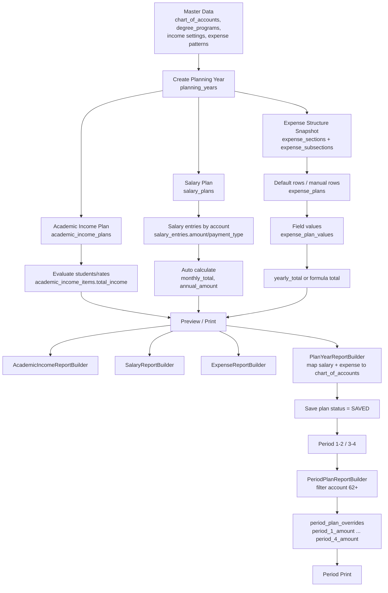

# Database Flow / ERD - fns_finance

สรุปนี้อ้างอิงจาก MySQL Docker database `fns_1`, migrations, Eloquent models, relationships, foreign keys, controllers และ report builders ของโปรเจกต์ โดยอ่านแบบ read-only

## 1. ภาพรวมระบบ

ระบบการเงินนี้มี `planning_years` เป็นแกนกลางของข้อมูลแผนประจำปี แล้วแตกข้อมูลออกเป็น 3 สายหลัก:

1. รายรับวิชาการ: `academic_income_plans` -> `academic_income_items`
2. เงินเดือน: `salary_plans` -> `salary_entries`
3. รายจ่าย: `expense_sections` / `expense_subsections` -> `expense_plans` -> `expense_plan_values`

จากนั้นหน้า preview / print จะรวมข้อมูลผ่าน service เหล่านี้:

- `AcademicIncomeReportBuilder`
- `SalaryReportBuilder`
- `ExpenseReportBuilder`
- `PlanYearReportBuilder`
- `PeriodPlanReportBuilder`

## 2. ตารางหลักและหน้าที่

| ตาราง | ใช้เก็บอะไร | PK / FK สำคัญ | ประเภทข้อมูล |
|---|---|---|---|
| `planning_years` | แผนประจำปี, สถานะ, รอบ review, เวลาบันทึกงวด | PK `id`, unique `year`, FK `current_review_round_id` | Transaction หลัก |
| `chart_of_accounts` | ผังบัญชีแบบ tree | PK `id`, unique `account_code`, FK `parent_id -> chart_of_accounts.id` | Master |
| `academic_income_setting_sets` | ชุดค่าตั้งต้นรายรับตามปี | PK `id`, unique `fiscal_year` | Master |
| `degree_programs` | หลักสูตร/ระดับ ป.ตรี/โท/เอก | PK `id`, unique `code` | Master |
| `course_credit_settings` | จำนวนหน่วยกิตต่อหลักสูตร | PK `id`, FK `degree_program_id` | Master |
| `credit_unit_price_settings` | ราคาหน่วยกิตตาม level | PK `id`, FK `setting_set_id` | Master |
| `nuol_pct_settings` | % ส่วน NUOL ตาม level | PK `id`, FK `setting_set_id` | Master |
| `income_rate_settings` | rate รายรับ item 3-6 | PK `id`, FK `setting_set_id`, unique `key` | Master |
| `registration_fee_settings` | ชุดค่าลงทะเบียน | PK `id` | Master |
| `registration_fee_items` | รายการย่อยค่าลงทะเบียน | PK `id`, FK `fee_setting_id` | Master |
| `academic_income_plans` | หัวแผนรายรับวิชาการต่อปี | PK `id`, FK `planning_year_id`, `created_by` | Transaction |
| `academic_income_items` | จำนวน นศ./ยอดรายรับต่อ section/program | PK `id`, FK `plan_id`, `setting_set_id`, `degree_program_id`, unique `plan_id, section_code, degree_program_id` | Transaction |
| `salary_plans` | หัวแผนเงินเดือนต่อปี/เดือน | PK `id`, FK `planning_year_id`, `created_by`, unique `fiscal_year, month` | Transaction |
| `salary_entries` | เงินเดือนต่อบัญชี | PK `id`, FK `plan_id`, `chart_of_account_id`, unique `plan_id, chart_of_account_id` | Transaction |
| `expense_patterns` | template การคำนวณรายจ่าย | PK `id`, unique `key` | Master |
| `expense_pattern_fields` | field ของ template รายจ่าย | PK `id`, FK `pattern_id`, unique `pattern_id, field_key` | Master |
| `expense_subsection_default_rows` | row ตั้งต้นของรายจ่าย และ account link | PK `id`, FK `chart_of_account_id` | Master / Default |
| `expense_sections` | หมวดรายจ่ายของแผนปี | PK `id`, FK `planning_year_id` | Transaction snapshot |
| `expense_subsections` | หมวดย่อยรายจ่ายแบบ tree | PK `id`, FK `section_id`, `default_pattern_id`, unique `section_id, code` | Transaction snapshot |
| `expense_plans` | row รายจ่ายจริงในแผนปี | PK `id`, FK `planning_year_id`, `section_id`, `subsection_id`, `pattern_id` | Transaction |
| `expense_plan_values` | ค่า field ของ row รายจ่าย | PK `id`, FK `expense_plan_id`, unique `expense_plan_id, field_key` | Transaction |
| `planning_year_field_settings` | ปรับ label/field ต่อแผนปี | PK `id`, FK `planning_year_id`, `pattern_field_id`, unique `planning_year_id, pattern_field_id` | Transaction / Config snapshot |
| `period_plan_overrides` | ยอดงวด 1-4 ต่อบัญชีวิชาการ | PK `id`, FK `planning_year_id`, `chart_of_account_id`, unique `planning_year_id, chart_of_account_id` | Transaction |
| `planning_year_review_rounds` | รอบส่งตรวจแผน | PK `id`, FK `planning_year_id`, `requested_by`, `closed_by`, unique `planning_year_id, round_number` | Transaction |
| `planning_year_reviewers` | ผู้ตรวจในแต่ละรอบ | PK `id`, FK `planning_year_review_round_id`, `user_id`, unique `round_id, user_id` | Pivot / Transaction |
| `planning_year_review_comments` | comment ในรอบตรวจ | PK `id`, FK `planning_year_review_round_id`, `planning_year_id`, `user_id` | Transaction |
| `planning_year_review_comment_agreements` | การเห็นด้วยกับ comment | PK `id`, FK `planning_year_review_comment_id`, `user_id`, unique `comment_id, user_id` | Pivot / Transaction |
| `users` | ผู้ใช้ระบบ | PK `id`, FK `role_id`, `department_id`, unique `username` | Master / Auth |
| `roles` | สิทธิ์ผู้ใช้ | PK `id`, unique `role_name` | Master / Auth |
| `departments` | หน่วยงาน | PK `id`, unique `department_name` | Master |

## 3. ความสัมพันธ์

### 1-1

ยังไม่พบ relationship แบบ 1-1 ที่ enforce ด้วย FK/unique ชัดเจนใน DB จริง

### 1-many

- `planning_years` 1 -> many `academic_income_plans`
- `planning_years` 1 -> many `salary_plans`
- `planning_years` 1 -> many `expense_sections`
- `planning_years` 1 -> many `expense_plans`
- `planning_years` 1 -> many `period_plan_overrides`
- `planning_years` 1 -> many `planning_year_review_rounds`
- `academic_income_plans` 1 -> many `academic_income_items`
- `salary_plans` 1 -> many `salary_entries`
- `expense_sections` 1 -> many `expense_subsections`
- `expense_subsections` 1 -> many `expense_subsections` ผ่าน `parent_id`
- `expense_patterns` 1 -> many `expense_pattern_fields`
- `expense_plans` 1 -> many `expense_plan_values`
- `chart_of_accounts` 1 -> many `chart_of_accounts` ผ่าน `parent_id`
- `chart_of_accounts` 1 -> many `salary_entries`
- `chart_of_accounts` 1 -> many `period_plan_overrides`

### many-many

- `planning_year_review_rounds` many-many `users` ผ่าน `planning_year_reviewers`
- `planning_year_review_comments` many-many `users` ผ่าน `planning_year_review_comment_agreements`

หมายเหตุ: บางจุดเป็น many-to-one ตาม business เช่น salary entry หนึ่งแถวชี้บัญชีเดียว แต่บัญชีหนึ่งถูกใช้ได้หลาย salary entries ในหลาย plan

## 4. Data Flow หลัก

### 4.1 เริ่มจากสร้างแผนปี

1. ผู้ใช้สร้างปีใน `planning_years`
2. `ManagePlanController::store()` สร้าง companion data:
   - `academic_income_plans`
   - `salary_plans`
   - `expense_sections`
   - `expense_subsections`
3. ถ้ามีปีเก่าที่มี expense structure ระบบ copy structure จากปีเก่า
4. ถ้าไม่มีปีเก่า ระบบ build structure จาก `expense_subsection_default_rows`

### 4.2 Flow รายรับวิชาการ

1. Master data ตั้งต้น:
   - `degree_programs`
   - `course_credit_settings`
   - `academic_income_setting_sets`
   - `credit_unit_price_settings`
   - `nuol_pct_settings`
   - `income_rate_settings`
   - `registration_fee_settings`
   - `registration_fee_items`
2. หัวแผนอยู่ใน `academic_income_plans`
3. ผู้ใช้กรอก/ประเมินจำนวนนักศึกษาในหน้า evaluate
4. ระบบคำนวณและบันทึกลง `academic_income_items.total_income`
5. รายงาน preview ใช้ `AcademicIncomeReportBuilder` รวมยอดเป็น gross, NUOL, FNS income, teaching fee, remaining

### 4.3 Flow เงินเดือน

1. Master data หลักคือ `chart_of_accounts`
2. `SalaryPlanController::manage()` เลือกเฉพาะ leaf accounts ใต้รหัสบัญชีที่ขึ้นต้น `60` หรือ `61`
3. ผู้ใช้กรอกจำนวนคน, payment type, amount
4. บันทึกลง `salary_entries`
5. `SalaryEntry` คำนวณอัตโนมัติ:
   - `monthly_total = amount`
   - `annual_amount = monthly_total * 12`
6. `SalaryReportBuilder` รวมยอดตาม account และ roll-up ขึ้น parent account

### 4.4 Flow รายจ่าย

1. Master/default data:
   - `expense_patterns`
   - `expense_pattern_fields`
   - `expense_subsection_default_rows`
   - `chart_of_accounts`
2. เมื่อเปิดหน้า manage รายจ่าย ระบบ ensure default rows:
   - สร้าง `expense_plans`
   - สร้าง `expense_plan_values`
3. ผู้ใช้แก้ค่าใน row รายจ่าย
4. ระบบคำนวณ `yearly_total` จาก pattern เช่น:
   - `monthly = amount_per_month * month_count`
   - `unit_quantity = unit_price * quantity`
   - `unit_quantity_frequency = unit_price * quantity * times_per_year`
   - `frequency_based = unit_price * quantity * frequency_count`
   - `event_based = unit_price * event_count * people_count`
5. `ExpenseReportBuilder` รวมรายจ่ายตาม section/subsection
6. `PlanYearReportBuilder` map รายจ่ายเข้าผังบัญชีโดยดู:
   - link จาก `expense_subsection_default_rows.chart_of_account_id`
   - fallback จาก `reference` ถ้ามี

### 4.5 Flow งวด 1-2 / 3-4

1. ต้องบันทึกแผนปีเป็น `SAVED`
2. `PeriodPlanReportBuilder` เรียก `PlanYearReportBuilder`
3. กรองเฉพาะบัญชีวิชาการที่ account code ขึ้นต้น `62+`
4. ค่า default ต่อไตรมาส = `yearly_amount / 4`
5. ถ้าผู้ใช้แก้ยอด ระบบบันทึกลง `period_plan_overrides`
6. งวด 1-2 ใช้:
   - `period_1_amount`
   - `period_2_amount`
7. งวด 3-4 ใช้:
   - `average_increase_amount`
   - `average_decrease_amount`
   - `requested_decrease_amount`
   - `requested_increase_amount`
   - `period_3_amount`
   - `period_4_amount`
8. `planning_years.period_1_2_saved_at` และ `planning_years.period_3_4_saved_at` เป็นตัวบอกว่าบันทึกงวดแล้วหรือยัง

## 5. Master Data vs Transaction Data

### Master data

- `chart_of_accounts`
- `degree_programs`
- `course_credit_settings`
- `academic_income_setting_sets`
- `credit_unit_price_settings`
- `nuol_pct_settings`
- `income_rate_settings`
- `registration_fee_settings`
- `registration_fee_items`
- `expense_patterns`
- `expense_pattern_fields`
- `expense_subsection_default_rows`
- `users`
- `roles`
- `departments`

### Transaction data

- `planning_years`
- `academic_income_plans`
- `academic_income_items`
- `salary_plans`
- `salary_entries`
- `expense_sections`
- `expense_subsections`
- `expense_plans`
- `expense_plan_values`
- `planning_year_field_settings`
- `period_plan_overrides`
- `planning_year_review_rounds`
- `planning_year_reviewers`
- `planning_year_review_comments`
- `planning_year_review_comment_agreements`

### Snapshot/config ต่อปี

ตารางกลุ่มนี้ไม่ใช่ master ล้วน เพราะผูกกับปีแผนและถูก copy/ปรับตามปี:

- `expense_sections`
- `expense_subsections`
- `planning_year_field_settings`
- `expense_calculation_rules`

## 6. จุดที่ข้อมูลถูกเอาไปคำนวณ Preview / Print

### Preview แผนปี

Controller:

- `ManagePlanController::preview()`

Service ที่ถูกเรียก:

- `AcademicIncomeReportBuilder::buildForPlans()`
- `ExpenseReportBuilder::buildForPlanningYear()`
- `SalaryReportBuilder::buildForPlanningYear()`
- `PlanYearReportBuilder::buildForPlanningYear()`

View:

- `resources/views/dashboards/finance_head/manage-plan/preview.blade.php`

Print:

- ปุ่ม print ใน view เรียก `window.print()`
- ใช้ข้อมูลเดียวกับ preview

### Print รายรับวิชาการ

Controller / Service:

- `AcademicIncomePlanController::show()`
- logic คล้าย `AcademicIncomeReportBuilder`

View:

- `resources/views/dashboards/finance_head/academic-income/show.blade.php`

### Print งวด 1-2 / 3-4

Controller:

- `ManagePlanController::periodOneTwo()`
- `ManagePlanController::periodThreeFour()`

Service:

- `PeriodPlanReportBuilder::buildForPlanningYear()`

View:

- `resources/views/dashboards/finance_head/manage-plan/period.blade.php`

## 7. ERD Mermaid

```mermaid
erDiagram
    PLANNING_YEARS ||--o{ ACADEMIC_INCOME_PLANS : has
    PLANNING_YEARS ||--o{ SALARY_PLANS : has
    PLANNING_YEARS ||--o{ EXPENSE_SECTIONS : has
    PLANNING_YEARS ||--o{ EXPENSE_PLANS : has
    PLANNING_YEARS ||--o{ PERIOD_PLAN_OVERRIDES : has
    PLANNING_YEARS ||--o{ PLANNING_YEAR_REVIEW_ROUNDS : review_rounds

    ACADEMIC_INCOME_PLANS ||--o{ ACADEMIC_INCOME_ITEMS : has
    ACADEMIC_INCOME_SETTING_SETS ||--o{ ACADEMIC_INCOME_ITEMS : snapshot
    DEGREE_PROGRAMS ||--o{ ACADEMIC_INCOME_ITEMS : program
    DEGREE_PROGRAMS ||--o{ COURSE_CREDIT_SETTINGS : credits
    ACADEMIC_INCOME_SETTING_SETS ||--o{ CREDIT_UNIT_PRICE_SETTINGS : prices
    ACADEMIC_INCOME_SETTING_SETS ||--o{ NUOL_PCT_SETTINGS : nuol_pct
    ACADEMIC_INCOME_SETTING_SETS ||--o{ INCOME_RATE_SETTINGS : rates
    REGISTRATION_FEE_SETTINGS ||--o{ REGISTRATION_FEE_ITEMS : items

    SALARY_PLANS ||--o{ SALARY_ENTRIES : entries
    CHART_OF_ACCOUNTS ||--o{ SALARY_ENTRIES : salary_account
    CHART_OF_ACCOUNTS ||--o{ CHART_OF_ACCOUNTS : parent_child

    EXPENSE_SECTIONS ||--o{ EXPENSE_SUBSECTIONS : has
    EXPENSE_SUBSECTIONS ||--o{ EXPENSE_SUBSECTIONS : parent_child
    EXPENSE_PATTERNS ||--o{ EXPENSE_PATTERN_FIELDS : fields
    EXPENSE_PATTERNS ||--o{ EXPENSE_SUBSECTIONS : default_pattern
    EXPENSE_PATTERNS ||--o{ EXPENSE_PLANS : pattern
    EXPENSE_SECTIONS ||--o{ EXPENSE_PLANS : section
    EXPENSE_SUBSECTIONS ||--o{ EXPENSE_PLANS : subsection
    EXPENSE_PLANS ||--o{ EXPENSE_PLAN_VALUES : values
    CHART_OF_ACCOUNTS ||--o{ EXPENSE_SUBSECTION_DEFAULT_ROWS : default_link

    CHART_OF_ACCOUNTS ||--o{ PERIOD_PLAN_OVERRIDES : account
    PLANNING_YEAR_REVIEW_ROUNDS ||--o{ PLANNING_YEAR_REVIEWERS : reviewers
    USERS ||--o{ PLANNING_YEAR_REVIEWERS : reviewer
    PLANNING_YEAR_REVIEW_ROUNDS ||--o{ PLANNING_YEAR_REVIEW_COMMENTS : comments
    USERS ||--o{ PLANNING_YEAR_REVIEW_COMMENTS : author
    PLANNING_YEAR_REVIEW_COMMENTS ||--o{ PLANNING_YEAR_REVIEW_COMMENT_AGREEMENTS : agreements
    USERS ||--o{ PLANNING_YEAR_REVIEW_COMMENT_AGREEMENTS : agrees
```

## 8. Flowchart Mermaid

## 9. สรุปแบบสั้นมาก

- `planning_years` คือหัวแฟ้มของแผนปี
- รายรับเก็บยอดสุดท้ายใน `academic_income_items.total_income`
- เงินเดือนเก็บต่อบัญชีใน `salary_entries` และคำนวณ annual อัตโนมัติ
- รายจ่ายเก็บแบบ row + key/value ใน `expense_plans` และ `expense_plan_values`
- `chart_of_accounts` เป็นผังบัญชีที่ใช้ roll-up salary, expense และ period report
- Preview/print ไม่ได้อ่านยอดจากตารางเดียว แต่รวมจากหลาย service
- `period_plan_overrides` เป็นชั้นปรับยอดงวดหลังจากแผนปีถูกบันทึกเป็น `SAVED`
